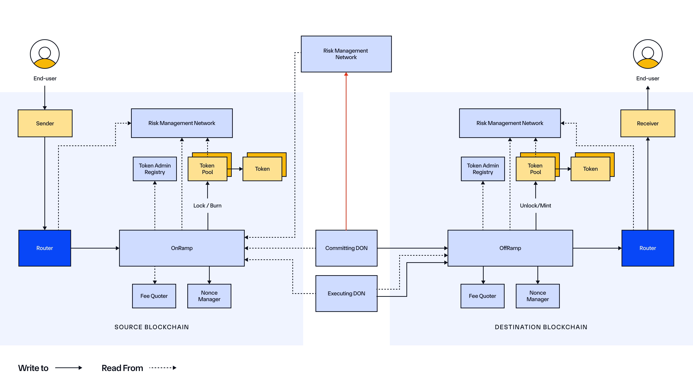

# Blockchain Bridges

- A blockchain bridge is a protocol that enables users to transfer assessts like tokens from one chain to another , hence there are various types of bridiging also 

1. Burn and Mint Bridge
- The tokens are burnt on the source chain and taken out of circulation
- These token the same amount is then minted on the destination chain
- Keeps the total supply constant

2. Lock and Unlock Bridge
- The funds are locked on a vault on the source chain
- Then unlocked on the vault on the destination chain
- This can lead to fragmented liquidity

3. Lock and mint Bridge
- Here lets say we already have few tokens with us and the protocol doesn't have the ability to burn or mint tokens
- So tokens are locked in the vault at the source chain
- Then new wrapped version of these tokens are minted on the destination chain
- Example USDCe

4. Burn and Unlock Bridge
- Here we first burn the tokens on the source chain
- Equivalent amount of tokens are then minted on the destination bridge issued from the vault

# CCIP (Cross Chain Interoperability Protocol)

- It allows you to send tokens/data cross chain, creating connection b/w isolated blockchain networks

- The CCIP protocol, the main oracle network has code and checks to keep the network safe, but there also exists a second set of chainlink nodes which is the RMN

- RMN (Risk Management Network), there are two types of these RMN node
    1. Off-Chain RMN Operations this has the operation named "Blessing": Which checks if the destination chain and the source chain messages match or not
        - How does this work ?, merkle tree is created for both and compared 
    2. "Cursing": Checks for reorgs and double executions,
        Blocks the effected lane if it detects an anomaly

## CCT (Cross Chain Token Standard)

- A token standard to seemlesly and easily integrate their tokens with CCIP

### Reasons For CCT Standard

1. Liquidation Fragmentation

## CCTP (Circle's Cross Chain Transfer Protocol) 

- CCTP is Circle's solution to move USDC accross chains in a secure way

- CCTP uses a differenct approach when compared to the other blockchain bridges, It uses a burn and mint mechanism
- What happens here is more of a burn and mint based mechanism

- Let's say we need USDC cross chain from ETH to ARB
- So the protocol will first burn the USDC on ETH and take it out of supply on the source chain and mint those tokens on the destination chain

### Problem with current blockchain bridges
- The main problem with this is when we are using tradional bridges it locks the tokens are generates "I.O.U" tokens, which increase the risk factor and in case of an attack these IOU tokens become worthless

- Liquidation fragmentation, The liquidity is fragmented among various chains which makes it more complex

### Workflow of the CCTP v1

1. User initiates transfer from Source Chain A to Destination Chain B using Circle's CCTP interface or smart contract.
2. The protocol burns USDC on Chain A.
3. A cross-chain message is generated with metadata (amount, sender, recipient, chain info).
4. The message is submitted to Circle’s attestation service.
5. Circle’s service validates the burn and issues a signed attestation.
6. On Chain B (destination), the user (or a relayer) submits this attestation.
7. USDC is minted on Chain B to the recipient's wallet.

⏱️ Transfer finality depends on the time to validate and relay the attestation (typically 1–2 minutes).

### Workflow of the CCTP v2 (Fast Transfers with Fast Transfer Allowance)

1. User initiates cross-chain transfer (e.g., from Ethereum to Arbitrum).
2. USDC is burned on the source chain (Ethereum).
3. A Fast Transfer Liquidity Provider (LP) immediately sends USDC on the destination chain (Arbitrum) to the recipient — before attestation is finalized.
    - This LP is pre-approved and backed by capital.
    - It could be Circle themselves or third-party partners.
4. The attestation is still submitted to Circle’s verification service in parallel.
5. Once finality and verification are complete, minted USDC is sent to the LP, reimbursing them for their pre-final liquidity.

✅ This approach dramatically reduces wait time for users while keeping the protocol secure and fully reconciled.

# CCIP Architecture Understanding

# ✅ Off-Ramp Architecture Summary (Cleaned Up)

The **Off-Ramp architecture** in Chainlink CCIP consists of two main **off-chain components**:

- 🛰️ **Execution DON**: Responsible for delivering messages.
- 🛡️ **Risk Management Network (RMN)**: Independently verifies message safety via attestations.

---

## 🔁 Message Flow

1. ✅ A user calls `ccipSend()` on the **source chain**, which emits an event via the `On-Ramp` contract.

2. ✅ The **Execution DON** observes this event, constructs a **Merkle root** of the messages, and submits it to the **Off-Ramp contract** on the destination chain.

3. 🔄 **In parallel**, the **Risk Management Network (RMN)**:
   - Independently verifies the same messages by reading source chain logs.
   - Reconstructs the Merkle root or message hash.
   - If the message is valid, RMN nodes generate a **cryptographic attestation** (like a digital stamp).

4. 🔐 The **Off-Ramp contract** checks the RMN attestation:
   - It verifies that a **quorum** of RMN nodes signed the same Merkle root/message hash.
   - Only if the attestation is valid, the system proceeds to the next step.

5. 🚀 The **Execution DON** calls the Off-Ramp to finalize delivery.
   - The Off-Ramp then invokes `ccipReceive()` on the target contract to deliver the message.

---

## 🛡️ Security Model

This architecture ensures **defense-in-depth**:
- ⚡ **Fast delivery** via Execution DON
- 🔒 **Secure message approval** only if independently verified and attested by RMN

This hybrid off-chain/on-chain model balances **efficiency** with **security guarantees**.

# 🔗 Full Chainlink CCIP Flow: On-Chain + Off-Chain

## ✅ 1. User initiates cross-chain message
- The user or dApp calls `ccipSend()` on the **Router contract** on the **source chain**.
- The Router:
  - Estimates the fee
  - Locks or burns tokens if necessary
  - Dispatches the message via `OnRamp` (emits event)

---

## 🛰️ 2. Execution DON observes the source chain
- Reads emitted events and collects messages.
- Builds a **Merkle root** from messages.
- Submits the Merkle root and proof to the **destination Off-Ramp**.

---

## 🛡️ 3. Risk Management Network (RMN) acts in parallel
- Independently reads the same events from source chain.
- Verifies message safety.
- If valid, signs an **attestation** (quorum-based approval).
- Attestations are shared off-chain or submitted on-chain to the destination Off-Ramp.

---

## 🔄 4. Destination Off-Ramp verifies and finalizes
- Verifies:
  - Merkle proof (message inclusion)
  - RMN attestations (security approval)
- Unlocks or mints tokens if included in the message.
- Delivers message to the receiver contract via `ccipReceive()`.

---

## 📥 5. Receiver contract processes message
- The destination contract receives the data or tokens.
- Executes business logic accordingly.

---

## ✅ Summary

> Chainlink CCIP unifies off-chain and on-chain logic:
> - **Execution DON** ensures message delivery
> - **RMN** ensures message security
> - **Router + OnRamp/OffRamp** ensure protocol enforcement on-chain

